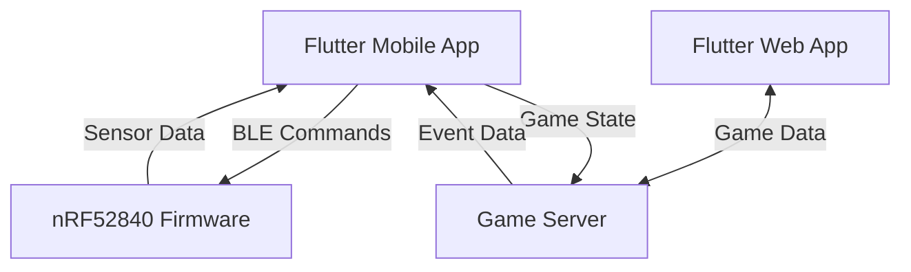

# RPG-IRL: The Live-Action Roleplaying Platform

## Project Overview

**What is this?** This repository contains the full stack for RPG-IRL: an open-source platform that merges LARP, location-based gaming, and custom hardware. It consists of a Flutter mobile app, NRF52840-based smart blasters, and a game server that turns the real world into a playground.

**The Goal:** To create a seamless system where players can transition from casual backyard duels to large-scale community events, with their smart blaster and phone providing a unified, magical game experience.

> **In a Nutshell:** A location-based LARP system where your phone is the game master and your blaster is your wand. Duel friends anywhere, discover quests in the real world, and join community events—all powered by a custom smart-blaster.

## 🎯 Key Features

- **🏹 Tiered Gameplay** - Jump between casual 1v1s, location-based ranked matches, and immersive community roleplay events
- **🔧 Smart Blaster** - 3D-printed blasters powered by nRF52840 microcontrollers
- **📱 Mobile First** - Flutter app handles GPS, quests, and player profiles
- **🌄 Low Fantasy Setting** - Magical elements grounded in familiar reality
- **✨ Magic System** - Location-based triggers activate spells and abilities
- **🏆 Guild System** - Form communities with specialized achievement paths

## 🌍 Lore & Worldbuilding

### The Core Premise: The Magitrace

Reality has a substrate—a faint, energetic lattice that underlies everything. This is **the Magitrace**. It's the residual blueprint of creation, a network of potential that most people can no longer perceive. They are "Trace-Blind."

You are not most people. You are a **Trace-Weaver**.

Trace-Weavers possess the innate ability to sense and interact with the Magitrace. Using specially crafted **Conduits** (the in-lore name for the Nerf blasters), you can "weave" patterns in the Trace, pulling temporary effects into reality.

### The Conduits (The Blasters)

A Conduit is not a weapon; it is an **interface device**. It translates a Weaver's intent into executable commands that manipulate the Magitrace.

**Conduit Types:**
- **Precision Loom** (Rifle-style blasters) - Designed for accurate, long-range weaves
- **Impact Forger** (Pistol-style blasters) - Built for powerful, short-range kinetic patterns
- **Ripple Emitter** (Automatic blasters) - Excels at rapid, sequential weaves
- **Macro-Weave Launcher** (Heavy blasters) - Capable of executing complex scripts

### The Magic System: Trace-Weaving

Magic is the art of writing and executing **Weave-Scripts**. By defining parameters that interact with the Magitrace, a Weaver creates a spell.

**Example Default Spells:**
- **Kinetic Pulse** - Basic concussive force (standard dart tag)
- **Reality Anchor** - Defensive shield weave
- **Resonance Beacon** - Reveals enemy positions on map

**Advanced Spell Programming:**
Advanced Weavers can write custom scripts using parameters unlocked at **Scripting Nodes** (POIs):
```
WEAVE_TYPE=KINETIC;
ON_HIT=APPLY_DEBUFF(SILENCE, 8s);
ON_HIT=TRIGGER_CHAIN(SILENCE, 3s, 2);
```

## 🎮 Gameplay Systems

### Gameplay Tiers

| Tier | Description | Player Commitment |
|------|-------------|-------------------|
| **Casual** | Instant 1v1 duels with friends | Low - Quick sessions |
| **Adventure** | Geocaching & ranked matches at POIs | Medium - Requires travel |
| **Community** | Narrative-driven LARP events | High - Story involvement |

### Achievement Paths: Forging Your Legacy

Guilds form around shared philosophies and can specialize in different paths:

#### 🗺️ The Cartographer's Path (Exploration)
**Philosophy:** "The greatest spells are found, not written."
- **First Contact** - Attune to your first Scripting Node
- **Trace Scout** - Discover 10 unique Scripting Nodes
- **Master Surveyor** - Map all Nodes in your region

#### 🎨 The Artisan's Path (Spellcraft)
**Philosophy:** "A well-tuned script is a poem written upon reality."
- **Apprentice Weaver** - Program your first custom weave
- **Signature Spell** - Have your weave used by 10+ players
- **Protocol Virtuoso** - Create a weave using 5+ parameters

#### ⚔️ The Duelist's Path (Competition)
**Philosophy:** "The crucible of combat tests a tuning's worth."
- **First Blood** - Win your first 1v1 duel
- **Unbroken** - Achieve a 5-win streak
- **Weave-Breaker** - Defeat 50 players under custom spell effects

#### 📖 The Chronicler's Path (Community)
**Philosophy:** "The Magitrace is a tapestry we weave together."
- **Storyteller** - Participate in community LARP events
- **Guild Founder** - Establish a new guild
- **Community Architect** - Host successful public events

## ⚙️ Technical Architecture

### Hardware (The Blaster)

**Current Prototype Status:** `[Design Phase]`

| Component | Purpose | Status |
|-----------|---------|--------|
| **nRF52840 Microcontroller** | Brain of the blaster, BLE communication | ✅ Selected |
| **BLE Communication** | Link to Flutter app for GPS/commands | 🔄 In Development |
| **Firing Mechanism** | Motor control for dart propulsion | 🛠️ Research Phase |
| **Sensors** | IMU for gesture recognition | 🔄 Planning |
| **Feedback Systems** | LEDs, buzzer, vibration | 🛠️ Prototyping |

### Software Architecture



**Component Responsibilities:**
- **📱 Flutter App:** GPS, UI, game logic, spell programming interface
- **💻 Flutter Web App:** Account management, Geofencing, event creation, data analysis
- **⚙️ nRF52840 Firmware:** Blaster control, BLE communication, sensor processing
- **🌐 Game Server:** Player accounts, guild management, event orchestration

## 🚀 Getting Started

*This section will be filled out as the project develops*

### Prerequisites
- 🖨️ 3D Printer
- 📱 Flutter SDK
- 🔌 nRF52840 toolchain (Zephyr RTOS or Arduino with BLE libraries)

### Build Status

| Component | Status | Notes |
|-----------|--------|-------|
| Hardware | 🟡 Planning | Initial designs in progress |
| Flutter App | 🟠 in Progress | Basic structure defined |
| Flutter Web App | 🟡 Planning | Initial designs in progress |
| Firmware | 🟡 Planning | BLE stack research |
| Game Server | ⚪ Not Started | Architecture planning |

## 🤝 Contributing

As a hobbyist project, contributions are incredibly welcome! Here are key areas where help is needed:

| Area | Skills Needed | Current Challenges |
|------|---------------|-------------------|
| **Electrical Engineering** | PCB design, power management | Motor drivers, power distribution |
| **Flutter Development** | UI/UX, BLE, maps | App architecture, cross-platform BLE |
| **Embedded Firmware** | Zephyr RTOS, C++, BLE | Driver implementation, power optimization |
| **Game Design** | Worldbuilding, balance | Spell system design, POI effects |
| **3D Modeling** | CAD, ergonomics | Blaster reliability, printability |

**How to contribute:**
1. Fork the repository
2. Create a feature branch (`git checkout -b feature/amazing-feature`)
3. Commit your changes (`git commit -m 'Add some amazing feature'`)
4. Push to the branch (`git push origin feature/amazing-feature`)
5. Open a Pull Request

Please open an **Issue** first to discuss major changes!

## 📄 License

This project is licensed under the `[e.g., MIT License]` - see the [LICENSE](LICENSE) file for details.

## 🙏 Acknowledgements

- **Zack Freedman** of [Voidstar Lab](https://www.youtube.com/c/ZackFreedman) for inspiration from Somatic and other 3D-printed blasters
- The **Flutter** and **Zephyr RTOS** communities for invaluable documentation
- The **Nerf hobbyist** community (`r/Nerf`, `r/NerfHomemade`) for blaster design knowledge
- **LARP communities** worldwide for inspiring social gameplay mechanics

---

**Ready to weave some magic?** ⚡✨
